# Backend plan: maximum verified app coverage

September 9, 2026. Planning deliverable; implementation tasks below are not yet
complete. Applies to backend/catalog installation work. V2 design belongs to the
other session; do not edit its prototype or production UI for this plan.

## v1 release goal, set by the owner on September 10, 2026

**One hundred apps in Local Store at v1, each verified and tested, chosen for
audience reach.** One click to install, and each one opens in its own desktop
window rather than a browser tab.

That last part is already true of every installed app and must stay true:
`open_app` builds a Tauri `WebviewWindowBuilder` titled with the app's name and
carrying its icon, one window per app, reused on reopen. Only navigation to a
*different* origin leaves for the OS browser.

### Why the previous approach cannot reach it

The work so far ran forwards from whatever the importers happened to express.
That produced three approved apps and a queue of 202 importable candidates —
but the candidates skew simple, and the apps people actually want are blocked.
Of roughly fifty household names checked on September 10, **only nineteen are
importable**: Vaultwarden, Grafana, WordPress, FreshRSS, linkding, BookStack,
Outline, Docmost, Joplin, File Browser, Vikunja, Memos, Glance, Dashy,
Heimdall, changedetection, ntfy, Gotify, Uptime Kuma. Immich, Jellyfin, Plex,
Nextcloud, Gitea, Pi-hole, AdGuard Home, Paperless, Sonarr, Radarr,
PhotoPrism, Authentik, Keycloak, MinIO and Home Assistant are not.

**So v1 works backwards from a ranked list, not forwards from what parses.**

### What blocks the apps people want

Measured across all 606 queued candidates, by how many become importable if
that one feature is solved:

| Feature | Apps blocked | Sole blocker | Notable apps |
| --- | --- | --- | --- |
| host path | 87 | **50** | Immich, Jellyfin, Plex, Sonarr, Radarr, PhotoPrism, Navidrome, Calibre-Web |
| plan policy | 17 | 17 | it-tools, Excalidraw, Homepage |
| plan rule | 15 | 15 | — |
| endpoint | 52 | 14 | — |
| public domain | 46 | 14 | — |
| healthCheck | 17 | 12 | — |
| addPorts | 31 | 11 | Gitea, Forgejo, Pi-hole, MinIO |
| environment | 90 | 10 | Wallabag |
| ports | 37 | 8 | AdGuard Home, Syncthing |
| user | 17 | 5 | Nextcloud, Authentik |

Solving the sole-blocker set takes 202 importable to roughly 336, before
counting apps that clear two blockers at once.

**Host path is the single biggest lever and the highest-reach one.** It is also
not a parser gap: these apps need a folder the person chooses, because a photo
or media library is not something to hide inside a managed directory. On a
Windows desktop "pick a folder for your media" is an ordinary, expected
interaction. Treat it as a first-class typed setup input with explicit
consent, an ownership guard, and a refusal to accept a path that would let an
app read somewhere it should not.

### The measured path to one hundred

Ranked by reach on September 10 (`python scripts/rank-candidates.py`,
`docs/candidate-ranking.md`):

| Ranked band | Importable today | Blocked |
| --- | --- | --- |
| top 100 | 39 | 61 |
| top 150 | 62 | 88 |
| top 200 | 104 | 96 |
| top 300 | 164 | 136 |

One hundred importable apps already exist inside the top 200, so v1 is
reachable with no capability work at all — but the lineup would reach down to
the two-hundredth most popular app. Four capabilities change that, counting
only apps inside the top 150 whose *sole* remaining blocker is that feature:

| Capability | Apps unlocked in the top 150 | Examples |
| --- | --- | --- |
| host path | 18 | Uptime Kuma, Dozzle, File Browser, Kavita |
| plan policy | 11 | Ghost, SearXNG, Excalidraw |
| healthCheck | 7 | n8n, NocoDB, ownCloud, Kimai |
| addPorts | 5 | Gitea, Mosquitto, EMQX, Owncast |

Those four take the top 150 from 62 importable to roughly 103 — **one hundred
apps drawn from the hundred and fifty most popular**, which is a materially
better release than a hundred drawn from two hundred. That is the v1 target.

Qualification will not pass everything, so expect to draw the shortfall from
ranks 150–200. Budget for it rather than lowering the bar.

Two things the ranking makes visible and a human review must still decide:
infrastructure images rank high on pulls but are not apps a person installs
(`nginx`, `mongo`), and some entries are variants of one app (`ollama-cpu`,
`ollama-amd`). Reach orders the queue; it does not choose the catalogue.

### v1 execution order

Each step below is gated on measurement, not on finishing a list.

| Step | Deliverable | Gate |
| --- | --- | --- |
| V1 — rank | Every queued candidate ranked by audience reach, from pinned public signals (Docker Hub pull counts, GitHub stars, how many source catalogues list it). Record importability and the blocking feature beside each. | A reproducible, checked-in ranking regenerated by a script; no hand-picked ordering. The top 150 must each carry a reason they are or are not installable today. |
| V2 — generate the manifest | Derive the mechanical 85% of a reviewed template from the queue, the catalog entry and registry metadata: identity, category, licence, URLs, image audit, data storage, and the risk notes that follow from the plan itself. | A generated manifest for an already-approved app is byte-equivalent to the hand-written one, apart from the fields a human owns: promotion, field labels, app-specific risk notes. |
| V3 — the standard, as a check | One app-agnostic first-use probe: the app opens to a real screen with a clear next step, and its managed data survives a restart and a keep-data reinstall. | Passes the three approved apps, and **fails** an app deliberately started with a wiped data directory. It proves an app presents a usable screen and keeps its data; it does not prove a person can finish a task, and the tier must say so. |
| V4 — capabilities, ranked | Implement blockers in the order the ranking says, host path first. | Per batch: a before/after count of newly importable *ranked* apps, refusal regressions kept, and at least one real lifecycle proof through the harness. |
| V5 — batch qualification | Run the ranked, importable set through `qualification::qualify` in resumable batches. | Machine time is not the constraint: roughly 40–60s per app means the whole queue is a few hours. Every result recorded; failures keep their reason. |
| V6 — promotion in groups | Present passing apps to the owner in reviewed groups with their evidence. | Approval stays a decision in a diff. `APPROVED` in `src/templates/mod.rs` names every offered app. |

### Honest tiers

An app is only called **verified** when a first-use probe specific to it proves
a person can complete a real task. **Tested** means it passed the standard in
V3. **Listed** means expressible and image-audited but never run. The v1 goal
is one hundred at verified or tested, and the product must not blur them.

### What could stop this

- **43 images across 42 importable candidates are on ghcr.io and cannot be
  audited**, because `check-template-platforms.py` speaks Docker Hub's JSON.
  GHCR needs a bearer token and returns an OCI index with no rebuild date.
  Popular apps are disproportionately on GHCR.
- Docker Hub publishes no pull count for GHCR images, so the ranking signal is
  weaker exactly where the audit gap is.
- Host path is a security boundary, not a feature toggle. Rushing it would be
  the worst possible way to reach a number.

## Goal and current position

After one-time Docker setup, a supported app should install with one action,
open to a useful browser screen, and retain its data through restart and update.
An app requiring an external account, license or API key must say so before
download. Those are setup-assisted installs, not zero-input installs.

At local commit `770e909`: three offered recipes; 117/356 CapRover and 85/250
Runtipi definitions expressible by the real importers. These sets overlap.
There is no measured unique total and no basis to call all of them usable.
CodiMD has lifecycle evidence but its template promotion is withheld for image
age. Typed setup UI/answer handling, reviewed-template metadata, locks, secret
preservation, health-dependent startup and recovery primitives already exist.

The bottleneck is now qualification and product integration, followed by missing
runtime capabilities. More source entries alone will not solve it.

## What Umbrel actually provides

Inspected main repository revision `bfa79ed24031b0065dd2f810411d58b82af1b95e`
and app repository revision `a8fe7e619b488d3682fd680fb6459583d59ad14f`.
The latter tree contains 391 top-level `umbrel-app.yml` files. This is a package
count, not a count portable to Windows or compatible with Local Store. Main
branch findings describe this snapshot, not a guarantee about every stable release.

| Mechanism observed | Source | Local Store decision |
| --- | --- | --- |
| Git-backed repositories, temporary clone then replacement, manifest registry and revision checks | [app-repository.ts](https://github.com/getumbrel/umbrel/blob/bfa79ed24031b0065dd2f810411d58b82af1b95e/packages/umbreld/source/modules/apps/app-repository.ts) | Keep pinned source snapshots; add atomic refresh and change-aware requalification. Do not silently approve moving source branches. |
| Explicit manifest fields for dependencies, credentials, HTTPS, storage and settings | [schema.ts](https://github.com/getumbrel/umbrel/blob/bfa79ed24031b0065dd2f810411d58b82af1b95e/packages/umbreld/source/modules/apps/schema.ts) | Extend our normalized capability/onboarding contract instead of inferring requirements from descriptions. |
| Selected app dependencies and dependent-aware removal/storage ordering | [apps.ts](https://github.com/getumbrel/umbrel/blob/bfa79ed24031b0065dd2f810411d58b82af1b95e/packages/umbreld/source/modules/apps/apps.ts) | Keep databases private to an app initially. Cross-app services need ownership/reference tracking before reuse is supported. |
| Shared gateway with upstream addressing, authentication defaults and route exceptions | [app-gateway.ts](https://github.com/getumbrel/umbrel/blob/bfa79ed24031b0065dd2f810411d58b82af1b95e/packages/umbreld/source/modules/app-gateway/app-gateway.ts) | Model routes, HTTPS/auth requirements and callbacks explicitly. Never remove proxy/auth behavior merely to make a package parse. |
| Managed paths, transitive dependency exports, derived app credentials and lifecycle hooks | [app-script](https://github.com/getumbrel/umbrel/blob/bfa79ed24031b0065dd2f810411d58b82af1b95e/packages/umbreld/source/modules/apps/legacy-compat/app-script) | Reuse our persisted generated secrets. Replace common hook needs with typed operations; do not source arbitrary host scripts. |
| Backend validation of install selections before Compose generation | [app.ts](https://github.com/getumbrel/umbrel/blob/bfa79ed24031b0065dd2f810411d58b82af1b95e/packages/umbreld/source/modules/apps/app.ts) | Retain PlanTemplate validation and the existing lock/commit transaction; UI is not an authority boundary. |
| A browser-based next step is the package standard | [app-store README](https://github.com/getumbrel/umbrel-apps/blob/a8fe7e619b488d3682fd680fb6459583d59ad14f/README.md) | Verification must exercise first use, not just HTTP 200. |

Two concrete examples:

- [Memos Compose](https://github.com/getumbrel/umbrel-apps/blob/a8fe7e619b488d3682fd680fb6459583d59ad14f/memos/docker-compose.yml)
  combines a digest-pinned image with an app proxy, managed data path, specific
  UID/GID and stop-grace setting. Even simple packages need a platform contract.
- [Immich Compose](https://github.com/getumbrel/umbrel-apps/blob/a8fe7e619b488d3682fd680fb6459583d59ad14f/immich/docker-compose.yml)
  coordinates several services; its [pre-start hook](https://github.com/getumbrel/umbrel-apps/blob/a8fe7e619b488d3682fd680fb6459583d59ad14f/immich/hooks/pre-start)
  includes permission preparation and intermediate-version migration handling.
  Copying only Compose would discard important lifecycle behavior.

Umbrel operates a controlled Linux environment; Local Store targets Windows
with Linux containers in Docker Desktop. Linux host paths, permissions, DNS and
device assumptions are not automatically transferable. The main code has a
[PolyForm Noncommercial license](https://github.com/getumbrel/umbrel/blob/bfa79ed24031b0065dd2f810411d58b82af1b95e/LICENSE.md).
The inspected app tree had no top-level license; packaging reuse permission
remains unresolved. Study the architecture, but prefer licensed existing
definitions or each app's own documented deployment until reuse is established.
No Umbrel implementation or assets are copied by this plan.

## Target architecture

```mermaid
flowchart LR
  A[Pinned catalogs or GitHub URL] --> B[Source identity and adapter]
  B --> C[Normalized plan and capability requirements]
  C --> D[Policy and host compatibility]
  D --> E[Qualification queue]
  E --> F[Isolated lifecycle and first-use verification]
  F --> G[Evidence and owner promotion]
  G --> H[Existing setup and install transaction]
  H --> I[Readiness and onboarding]
  I --> J[Update and recovery lifecycle]
```

Use existing `src/importers`, `src/plan.rs`, `src/setup`, `src/templates`,
`src/runtime`, registry and operation events. Do not build a parallel installer.
Maintain one canonical app identity across sources and select the best eligible
definition per app. Keep alternate definitions and reasons rather than merging
incompatible service layouts automatically.

## Execution ledger

| Batch | Deliverable | Completion gate |
| --- | --- | --- |
| B1 — inventory and ranking | Machine-readable, deduplicated candidate queue from both real import reports. Record source revision, images, inputs, capabilities and all blockers. | Every candidate has a canonical identity or explicit unresolved match; no double-counted coverage. Rank likely first-use success and maintenance before cheap parsing wins. |
| B2 — first approved imported app | Screen a small shortlist, including the handoff's linkding/Node-RED/Joplin suggestions; verify current images before expensive tests. Prepare one candidate using existing reviewed-template metadata. | Provenance, image/platform evidence, secret review, actual first-use and lifecycle report prepared for owner promotion. Wire the approved template through the existing command seam; no arbitrary-template execution endpoint. |
| B3 — reusable verification runner | Refactor existing lifecycle proofs into shared isolated helpers plus small app-specific first-use probes. Emit machine-readable results. | Successful and deliberately failing fixtures prove timeout, cleanup, redaction, unrelated-container protection, preserved credentials/data and deterministic evidence output. Resume interrupted batch runs without repeating completed work. |
| B4 — capability expansion | Implement the highest marginal-gain features below, in bounded batches. | Before/after unique-app report, refusal regressions and at least one real representative lifecycle proof per new capability. |
| B5 — stable addressing and onboarding | Explicit launch route, host/browser URL versus container URL, optional gateway, HTTPS/callback requirements and secure first-use credential delivery. | Browser login/setup, redirects, cookies, websocket and callback probes pass where required. No placeholder public hostname or silent TLS weakening. |
| B6 — another source | Compare current licensed Coolify/CasaOS definitions against the improved model; implement the source with best incremental unique yield. | Pinned real-adapter report plus verified representative apps. Do not adopt old survey estimates as forecasts. Umbrel adapter remains conditional on reuse permission and complete platform translation. |
| B7 — GitHub resolver | Public URL resolves to known approved app first, then commit-pinned supported deployment files. Return candidate/readiness explanation. | Exact repository/commit/file identity, bounded fetch and redirect handling; unsupported repositories get actionable reasons. Unknown source gets review, not the approved one-click label. |
| B8 — controlled source builds | Evaluate an existing build provider after verifying its license, architecture and current support. Resolve/build immutable artifacts and use the same plan pipeline. | Isolated build cannot inherit host credentials/socket/mounts; image provenance, reproducibility limits, resource/time bounds and lifecycle proof recorded. No README-command execution. |
| B9 — sustainable updates | Refresh sources and image metadata, invalidate affected evidence, rerun qualifications, propose reviewed updates. Add migration-aware upgrade/restore evidence. | Source/adapter/plan/image/platform changes cannot inherit stale approval silently; application data survives the supported upgrade path or the update is withheld. |

B1–B3 are the first implementation cycle. Do not wait for gateway, source builds
or another importer to deliver the first real imported install. Promotion stays
the owner's decision under the existing repository agreement; prepare complete
evidence first and group candidates for efficient review.

## Capability priorities for B4

Report counts below overlap and are not additive. Measure newly unblocked
unique apps, not occurrences of a field.

1. **Container variable expressions in probes.** Runtipi has 17 remaining
   healthCheck blockers. Distinguish source placeholders, Compose interpolation
   and container expansion; preserve `$$` correctly, never execute substitutions
   on the host, and test actual container-side resolution without logging secrets.
2. **Explicit user/platform and graceful stop.** Runtipi reports 14 user and six
   stopGracePeriod blockers. Model these faithfully; test Docker Desktop volume
   ownership and requested architecture. Do not use recursive host chown as a fix.
3. **Packaged configuration and initialization.** Separate immutable config
   files, app-owned writable data and explicitly selected external folders.
   Many of the 73 host-path refusals may be genuine external access needs;
   classify them before claiming they can be converted to managed mounts.
   Support typed file creation and one-shot container jobs with declared mounts,
   deadlines and completion semantics instead of importing arbitrary host hooks.
4. **Digest resolution.** A bounded registry resolver may resolve a tag once,
   retain the original tag plus immutable index/platform digests, and require
   review/verification of that result. Digest pinning is reproducibility, not
   evidence an old image is maintained. Treat this as a deliberate policy extension.
5. **Multiple endpoints.** CapRover reports 37 ports and 52 endpoint blockers;
   Runtipi reports 31 addPorts. Separate primary browser entry, internal-only
   dependencies, loopback auxiliary TCP ports, and LAN/UDP/device-dependent apps.
   Implement loopback-only cases first. Port allocation must be atomic for the
   complete set and recovery must identify ownership rather than guessing by port.
6. **Cross-app services, GPU and devices.** Add only after the queue demonstrates
   meaningful demand. Shared service deletion needs references/ownership;
   hardware access needs host capability checks and explicit user choices.
   Preserve standalone database isolation as the default.

## Verification and honest product states

Evidence identity: canonical app + source commit/path + adapter version + plan
hash + image digests + target architecture + relevant Docker/Compose versions.
Separate compatibility, maintenance, lifecycle and first-use results. A recent
image rebuild alone does not prove maintained application code or safe dependencies.

Each offered app must pass fresh install, startup failure handling, browser
first use (create/read meaningful content where applicable), restart, keep-data
removal/reinstall, credential preservation and explicit owned-resource deletion.
Updates need their own supported migration path; install rollback is not database
downgrade. Use scoped backups/restores where an app supports them.

States consumed by V2: discovery-only; candidate; verifying; verified zero-input;
verified setup-assisted; unsupported-on-this-host; withheld/stale. Include reason,
required capabilities, verification timestamp and source identity. The backend
contract can advance independently of the other session's visual design.

Progress targets are gates, not promises: first approved imported app, then 10,
then 25 unique verified apps before committing to a 50-app target. Report the
zero-input subset separately. Track failure rate, time to first usable screen,
update success, verification age and manual review effort per additional app.
Do not promise all GitHub repositories, every catalog entry, or all 391 Umbrel
packages will work on this host.

## Immediate next batch and handoff

- [x] Produce B1 candidate inventory and explicit identity baseline: `catalog/candidate-queue.json`, `docs/candidate-queue-baseline.md` (September 9). Verified unique-app count remains unknown; unresolved identities are retained.
- [x] Complete bounded B1 maintenance/first-use screening and rank a reconciled shortlist: `docs/candidate-screening.md`. PrivateBin first for qualification; no new app approved. Full-catalog review remains ongoing.
- [ ] Screen five candidates for current images, upstream deployment support and
      minimal setup; record why each advances or is withheld.
- [ ] Verify the strongest candidate with existing runtime/proof helpers.
- [ ] Prepare its reviewed manifest and promotion evidence for the owner.
- [ ] Document the exact backend command integration needed after approval.

Keep Windows as the shipping target. Leave V2 files, signing/updater deferral,
and existing user changes alone. No push or release is authorized by this plan.
