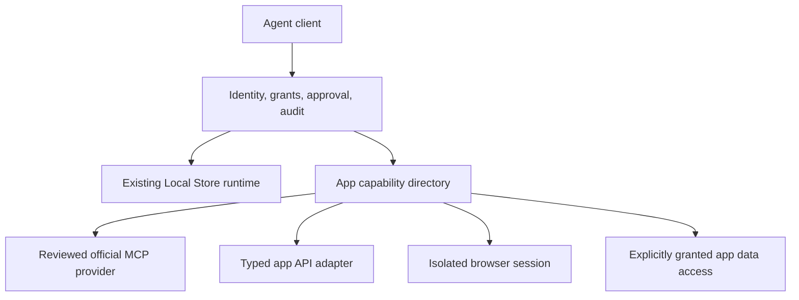

# Agent access to the store and every offered app

V1 requirement confirmed by the owner September 12, 2026. Task status lives in
[V1_TASKS.md](../V1_TASKS.md), A01–A08. This is an implementation proposal,
not a claim that MCP, app adapters or browser automation already ship.

## One gateway, multiple access methods

Expose a small discovery interface rather than thousands of tools at startup:
`list_apps`, `describe_app_access`, `list_app_tools`, `call_app_tool` and
operation/result lookup. These are proposed contract names. Each tool is typed,
bound to an installed app ID and a caller grant, and carries its risk and
approval requirements. Calls go through existing runtime locks and ownership
checks; the gateway is not a second installer.

The creative opportunity is that the installer already knows the app's identity,
engine, addresses, data mounts and generated credentials. It can create an
**access recipe** alongside a deployment recipe, avoiding manual connection
configuration for every agent. This does not grant permission to read content.

## Provider selection

| Method | When it fits | What must be proved |
| --- | --- | --- |
| Official app MCP | App already exposes maintained tools | Pin/review the server, scope its app token, proxy only granted tools, enforce policy on every call rather than trusting the upstream server's annotations. |
| Typed HTTP API / OpenAPI | Stable app API, including REST or JSON-RPC | Generate clients where helpful, then review endpoint schemas and side effects. Bind host and token server-side; do not expose arbitrary authenticated HTTP requests. |
| Browser session | App has a usable web UI but no suitable API | Run a maintained browser automation library in an isolated sidecar on the selected app's network. Support element inspection and bounded actions; persist an app-specific profile only with consent. Prove login and a real task. |
| App-owned files | Formats such as notes/config are a useful supported interface | Resolve paths under that app's granted storage, reject traversal/symlinks, enforce size/type limits, and use atomic writes or the app's API. Database files are not editable documents. |
| Database adapter | A reviewed app-specific query surface is necessary | Use a scoped account and reviewed operations, default read-only. SQL writes need schema/transaction knowledge and explicit grants. Never expose all databases because Docker is local. |

Content capability is separate from management. An app can be installed and
started while awaiting the user's login, token or vault unlock. Show that state
instead of fabricating a working connection. Browser automation is a broad
fallback, not proof that every web app will work without adapter effort.

## Coverage matrix and release gate

Produce `catalog/agent-access.json` only once its schema and backend consumer
are implemented; do not add a decorative manifest now. For each release app:

- Canonical app ID and exact deployment/probe/provider versions.
- Chosen methods, tools and read/write/admin classifications.
- Authentication source and setup still required; never store secret values
  in this catalog file.
- Address/network/profile scope and access to files or databases, if any.
- Required grants and approval behavior.
- Real task evidence, restart/reconnect behavior, denial/revocation evidence.
- Explicit missing operations and external dependencies.

Count management coverage, content-read coverage and content-write coverage
separately. V1's all-app-access goal means every offered app has a **useful,
demonstrated path**. Read-only apps need a meaningful read task; editable apps
need representative read/write proof. An unsupported app cannot satisfy the
gate with an empty tool list or only `open_window`. Solve its access method or
ask the owner to revise the roster. Do not claim every feature of every app.

## Permissions and credentials

Identity is per client. Grants are per app, operation class and lifetime;
revocation must affect existing sessions. Secrets are injected by the broker,
never returned as discovery data or model-visible logs. Use OS-backed protected
storage where appropriate; verify actual credential ownership and rotation.

Proposed baseline: observe/read grants may be remembered; writes require an
explicit write grant; destructive data removal, broad execution, raw secret
export and permission changes require a fresh launcher approval. The agent
cannot approve itself, edit its grant record or delete its audit history.
Final interaction details belong in V3, with a backend-verifiable approval
record bound to the exact action and caller.

Store progress events are not durable security audit. Agent access requires a
separate redacted audit record before broad writes ship. Keep retention bounded
and visible; avoid persisting prompts, tokens or private document contents by
default. The old session-only Activity design does not waive this requirement.

An agent with an unrestricted shell under the same Windows account can bypass
the gateway and access local Docker or files. State that limitation. A stronger
OS identity/service boundary needs a separate design; do not claim that a
permission screen alone enforces process isolation.

## Browser fallback boundaries

- Reuse a maintained automation implementation after verifying its license and
  deployment requirements. Do not implement a browser or scraping framework.
- Do not enable remote debugging on the user's signed-in production WebViews.
- Scope each sidecar to the app network and profile; no host Docker socket,
  privileged mode, arbitrary host folders or launcher IPC capabilities.
- Bind destinations to reviewed app endpoints. Authentication redirects and
  external actions require declared handling; arbitrary URL navigation is not
  an implicit grant to the host, LAN or internet.
- Treat page text, screenshots and downloaded files as untrusted app content.
  They may instruct an agent, but cannot alter gateway policy.
- Require user login where automation cannot safely provision credentials.
  Password managers and client-encrypted stores must retain their unlock model.
- Quarantine downloads and require a separate export action to write to the
  user's chosen folder. Bound time, memory, parallel sessions and output size.

## Writes, undo and safety

Prefer app APIs for mutations and backup rather than raw data edits. Before
offering undo, prove a consistent snapshot of all relevant mounts, named
volumes and secrets, with database quiescence or native backup as necessary.
Encrypt backups containing credentials. Browser-local data may need separate
handling; copying the managed folder alone does not include it.

Restoring a snapshot may discard a person's intervening edits. Present the
scope and require approval. Sent messages, payments, webhooks and other
external effects cannot be rolled back by restoring local files. Do not label
that feature universal undo.

## First implementation slice

1. Directory contract and permission model, using installed-app IDs.
2. Read-only store MCP and a fake caller for denial/revocation tests.
3. Controlled lifecycle/install actions through existing runtime functions.
4. One API adapter, one official MCP integration and one browser-only app,
   each with real read/write or appropriate read-only tasks.
5. V3 connection, approval and audit flows; broaden access recipes alongside
   the app qualification roster.

The [research survey](../research/agent-platform-and-differentiation.md) lists
candidate libraries and integrations. Recheck their current primary docs before
selecting them. Raw shell/exec, unrestricted SQL and a cross-app superuser token
are not shortcuts to the all-app coverage goal.
